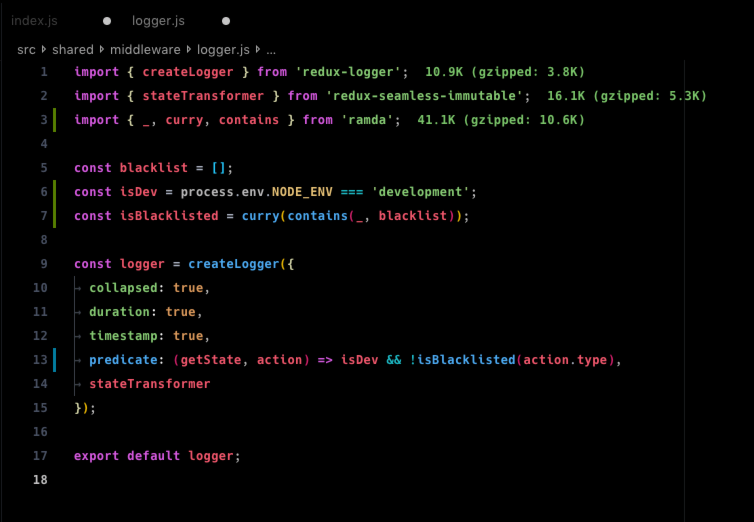

# Hyper-Dark

HyperTerm inspired VSCode theme with vivid syntaxcolors and a pitch black UI. _Drools on the floor.._



[GitHub repository](https://github.com/HasseNasse/hyper-term-theme)

# CHANGELOG

[CHANGELOG.MD](https://github.com/HasseNasse/hyper-term-theme/blob/master/CHANGELOG.md)

# Docs & Contribute

1. Install the theme
2. Reload VSCode
3. Press ctrl(⌘) + k, then press ctrl(⌘) + t, you will see a theme selection interface. Choose 'Hyper Term Black'.
4. Change the following user settings on VS Code:

```javascript
{
    "editor.fontFamily": "Menlo, 'DejaVu Sans Mono', Consolas, 'Lucida Console', monospace",
    "workbench.colorTheme": "Hyper Term Black",
    "editor.cursorStyle": "block",
    "editor.minimap.enabled": false,
    "editor.renderLineHighlight": "none"
}
```
